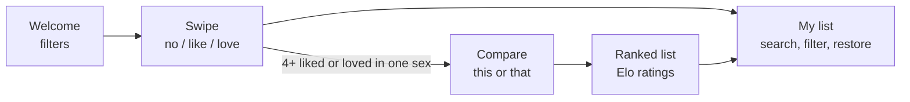

<p align="center">
  
</p>

<h1 align="center">Nameblocks</h1>

<p align="center">
  <strong>Swipe through UK and Irish baby names, then rank your favourites head to head.</strong><br>
  A small, private web app. No sign-up, no server, no tracking.
</p>

<p align="center">
  <a href="https://liam223.github.io/babynames.github.io/"><strong>Open the app &rarr;</strong></a>
</p>

<p align="center">
  
  
  
  
  
</p>

<p align="center">
  
  &nbsp;
  
  &nbsp;
  
  &nbsp;
  
</p>
<p align="center">
  <sub>Welcome &middot; Swipe &middot; Compare &middot; Ranked</sub>
</p>

---

## What it does

1. **Swipe** through thousands of names. Left is *no*, right is *like*, up is *love*. Tap the buttons or use the arrow keys if you prefer.
2. **Compare** your liked and loved names two at a time. Tap the one you prefer.
3. **See your ranking.** An Elo rating turns those taps into an ordered list, kept separately for boys' and girls' names.

Everything is saved in your own browser. Nothing is uploaded anywhere.



### Highlights

- **Names with context.** Each card shows the overall rank, babies given the name in 2021&ndash;25, a rising/falling trend with a sparkline, the rank in England &amp; Wales, Scotland, Northern Ireland and the Republic of Ireland, and a flag when one country stands out.
- **Strong Irish coverage.** Names are combined from four official sources, with a curated list plus a pattern check to tag Irish names (&#9752;&#65039;). Oisín and Oisin are one card; Aoife and Eva stay separate.
- **Filters.** Boys, girls or both (a name used for both appears once as *Unisex*), Irish only, popularity band (including **Retro**: older names that were popular in the past but are rare today), and starting letter.
- **Name details.** Tap a card (or use the ⓘ button on any list row) for a details screen: popularity, the **whole history** back to 1964 / 1974 / 1996 with a trend line, and per-country rows showing each country's 2021–25 rank and babies, an "especially popular" tag and the whole-history total, the boys/girls split for unisex names, spellings, and, where available, **origin, meaning, IPA and an English-friendly pronunciation**.
- **Honest ranking.** Boys and girls are compared in separate pools, so a boy is never pitted against a girl. A unisex name has its own rating in each pool.
- **Private by design.** Choices live in `localStorage`; export and import a backup to move to a new phone.
- **Accessible.** Buttons for every gesture, ARIA labels, a live region announcing decisions, `prefers-reduced-motion` and dark mode.

<p align="center">
  
  &nbsp;&nbsp;
  
</p>
<p align="center">
  <sub>Dark mode &middot; Desktop (tabs line up with the content column)</sub>
</p>

---

## Run it locally

No build step and no dependencies for the app itself.

```bash
python scripts/serve.py        # http://localhost:8080
```

`serve.py` is a tiny static server that sets correct JavaScript MIME types on Windows. Any static server works, as long as it serves the repo root.

> **Tip:** browsers cache the stylesheet and modules aggressively. After editing, hard-refresh (Ctrl/Cmd+Shift+R) or use a fresh `?v=` query on the page URL.

### Deploying

GitHub Pages serves the `main` branch from the repository root. `.nojekyll` makes Pages serve every file as-is. It is a *project site*, so the app lives under `/babynames.github.io/` and **every asset path must be relative** (`./data/boys.json`, never `/data/boys.json`).

---

## Project layout

```
index.html              Single page: all screens are <section>s toggled by app.js
css/styles.css          Design tokens, components and layout (self-contained)
js/
  app.js                Screens, state, filtering, queue, cards, list, ranking UI
  swipe.js              Pointer-event gestures (touch + mouse) and the stamp/glow feedback
  elo.js                Rating maths and pair selection; every tunable is in CONFIG
  names.js              Loads the JSON data, grouping key, trend and "standout" stats
  storage.js            localStorage wrapper, migrations, export/import, persistence request
  icons.js              Inline SVG icon set
data/boys.json          Generated name data (do not edit by hand)
data/girls.json
data/info.json          Generated origin / meaning / pronunciation, loaded only when a details screen opens
data/history/           Generated births per year over each source's whole history, one small file per sex and letter
fonts/                  Fraunces 700 (latin + latin-ext subsets), self-hosted
icons/logo.svg          The BABY block logo (also the favicon)
scripts/
  fetch-data.py         Downloads the raw source files into data-src/
  build-names.py        Builds data/boys.json and girls.json from data-src/
  build-info.py         Builds data/info.json from Wiktionary and Wikipedia (needs internet)
  build-history.py      Builds data/history/*.json from the raw files in data-src/ (offline)
  serve.py              Local static server
data-src/
  irish-names.txt       Curated Irish-origin names (committed)
  irish-review.txt      Names tagged by pattern only / left untagged as uncertain
  respellings.txt       Hand-written, approximate, UNVERIFIED pronunciation respellings (fallback only)
docs/screenshots/       Images used in this README
BRIEF.md                The original build brief
```

---

## How it works

### Swipe round

- **Order.** Names are shuffled with a weighted random order (Efraimidis&ndash;Spirakis) where the weight is `1 / (rank + 25)^0.65`. Popular names tend to come first so the early cards feel familiar, but rarer ones still mix in. The shuffle is seeded and saved, so your position survives a reload. A name is never shown twice.
- **Unisex names.** In *Both* mode a name that exists in both lists is one card, and your decision is saved for both sexes.
- **Gestures** (`swipe.js`): a swipe commits past **100 px**, or as a fast flick (>0.55 px/ms) that travels at least **60 px**. Under 12 px nothing shows, so a nudge never flashes a stamp. If the browser steals the touch, the card springs back.
- **Undo** steps back through up to 200 decisions.

### Compare round and ratings

Comparing happens inside one pool at a time: boys' names, or girls' names. A unisex name is in both pools and keeps a **separate rating in each**; ratings are never compared across pools. The Compare tab unlocks at **4** liked or loved names in a pool. It opens on the pool you used last, otherwise the one with more names.

Ratings use Elo. All numbers live in `CONFIG` in [`js/elo.js`](js/elo.js):

| Setting | Default | Meaning |
|---|---|---|
| `startLike` | 1500 | Starting rating of a Liked name |
| `startLove` | 1600 | Starting rating of a Loved name (a head start, not a guarantee) |
| `kEarly` | 32 | Largest change per vote while a name has few comparisons |
| `kLate` | 16 | Smaller changes once well tested |
| `lateAfter` | 10 | Comparisons before switching from `kEarly` to `kLate` |
| `hintAfter` | 20 | Comparisons before suggesting "check your top 10" |
| `topTestChance` / `topN` | 0.15 / 3 | How often a round features one of the current leaders |

After each vote, with `E` the expected score from the rating gap (`1 / (1 + 10^((Rb - Ra)/400))`), the winner gains `K × (1 − E)` and the loser loses `K × E`. Pairs prefer names with the fewest comparisons and similar ratings, never repeat the previous pair, and avoid pairs already shown this session.

> In simulations with randomly assigned Loved flags, the default settings recover about two-thirds of the true top 10 after 30 votes for lists of 15&ndash;20 names, rising to roughly 75&ndash;80% by 45&ndash;60 votes. Real Loved flags should correlate with preference, so real use is probably a little better. Everything is in `CONFIG`, so it is easy to tune once there is real usage.

### Layout and navigation

- **Phones (&lt; 600 px):** a fixed bottom tab bar (Swipe, Compare, My list, Settings), respecting the iOS safe area.
- **Wider screens:** the same four tabs become a second header row, exactly as wide as the content column.
- The card stage uses `svh` units so Safari's collapsing toolbar can't resize it, and `scrollbar-gutter: stable` stops the page shifting when a scrollbar appears.

---

## The name data

Counts come from four official sources. **Modern names** use the last five years (2021&ndash;2025); a longer history is used only to find **classic** names (see below).

| Source | Coverage | Licence |
|---|---|---|
| [ONS](https://www.ons.gov.uk/) | England and Wales | Open Government Licence v3 |
| [National Records of Scotland](https://www.nrscotland.gov.uk/) | Scotland | Open Government Licence |
| [NISRA](https://www.nisra.gov.uk/) | Northern Ireland | Open Government Licence |
| [CSO](https://www.cso.ie/) | Republic of Ireland | CC BY 4.0 |

### Rebuilding it

You only need this when new years are published.

```bash
pip install openpyxl
python scripts/fetch-data.py     # downloads raw files into data-src/ (git-ignored, ~100 MB)
python scripts/build-names.py    # writes data/boys.json, data/girls.json, data-src/irish-review.txt
```

When a new year is published, update the URLs in `fetch-data.py` and `YEARS` / `VERSION` in `build-names.py`.

What the build does:

1. Sums counts across the four sources for the last five years. These drive every count, rank, trend and country rank, and the choice of spelling.
2. **Groups spellings that differ only by accents or case** using a stripped, lowercased key. The accented spelling is shown if it holds at least 15% of the group's total (the UK sources strip accents, so accented forms are undercounted). Genuinely different spellings stay separate.
3. Drops names with fewer than **15** births in 2021&ndash;25 (`MIN_TOTAL`); names on the curated Irish list keep a lower floor of **5** (`IRISH_MIN_TOTAL`), **unless they qualify as classics (below)**.
4. Ranks within each sex, and computes per-year counts and per-country counts and ranks.
5. Tags Irish-origin names from `data-src/irish-names.txt` (lines marked `# ?` are uncertain and not tagged), plus a pattern check (`bh`, `dh`, `mh`, `aoi`, fadas) applied to names that are mostly found in the CSO data.

#### Classic names

Official sources hide any name given to fewer than 3 babies in a year, so there is no way to get *more names per year*. The only way to widen the list is a longer window. The build also reads each source's full history (ONS 1996+, NISRA 1997+, NRS 1974+, CSO 1964+) and keeps a name that fails the recent rule as a **classic** if either:

- it is on the curated Irish list and has **5+ births across all years** (`IRISH_HISTORY_MIN`), or
- it **peaked in 2005 or earlier** (`CLASSIC_PEAK_BY`), has **100+ births across all years** (`CLASSIC_MIN_TOTAL`), and is rare today (under 15 recent births), or
- it has **30+ births across all years in at least 3 separate years** (`BROAD_MIN_TOTAL`, `BROAD_MIN_YEARS`) and is rare today. The year rule keeps out one-off spellings.

Classics are **ranked after every modern name**, so existing ranks, the Top 100 / Top 500 filters and anything already saved are unaffected. They show a card with the peak year instead of rank and country tiles (*A classic name* if they peaked by 2005, *A past favourite* if later), and appear under the *Retro* popularity filter. All the thresholds are constants at the top of `scripts/build-names.py`.

Current output:

| | Modern | Classic | Total | Irish-tagged | Size (gzipped) |
|---|---|---|---|---|---|
| Boys | 5,015 | 2,680 | **7,695** | 256 | 415 KB (118 KB) |
| Girls | 5,799 | 4,063 | **9,862** | 270 | 518 KB (143 KB) |

(The girls' file is above the original ~400 KB target, but it is only about 143 KB over the wire.)

The modern names are byte-for-byte identical to the previous build (same entries, same ranks); classics are only appended.

### File format

```jsonc
{
  "version": "2026-10-2",
  "sources": ["ONS 2021–2025", "NRS 2021–2025", "NISRA 2021–2025", "CSO 2021–2025"],
  "years": [2021, 2022, 2023, 2024, 2025],
  "countries": ["England & Wales", "Scotland", "Northern Ireland", "Republic of Ireland"],
  "history": {"ONS": [1996, 2025], "NISRA": [1997, 2025], "NRS": [1974, 2025], "CSO": [1964, 2025]},
  "yearTotals": [352978, 340491, 329841, 330119, 323584],   // all babies of this sex, per year
  "countrySizes": [10387, 1471, 813, 1575],                  // distinct names per country
  "names": [
    // [display, recentTotal, rank, irish(0/1), variants[], perYear[5], perCountry[4], countryRank[4]]
    ["Oisín", 2685, 129, 1, ["Oisin", "Óisín"], [553, 560, 534, 489, 549], [364, 71, 557, 1693], [535, 271, 8, 5]],
    // classic (historical-only) names use a short 6-element tuple: [..., variants[], [peakYear, peakCount, totalAllYears]]
    ["Graeme", 12, 5016, 0, [], [1979, 450, 5200]]
  ]
}
```

---

## Whole history

The details screen's **Over the years** panel turns this into something you can read at a glance: a one-line summary ("A 1990s favourite, now about 21% as common"), three tiles (**Peak**, **Now** as a share of the peak, and **Trend** over the last decade), a bar chart with a smoothed 5-year rolling-average line plus peak and latest-year markers (drag along it to read any year), and coloured country rows with sparklines and each country's 2021–25 rank and babies (England & Wales red, Scotland blue, Northern Ireland yellow, Republic of Ireland green) that double as the selector. Names with only a handful of non-zero years show bars without the line, since a smooth curve would imply a trend that is not there.

Cards and the main data files only carry 2021&ndash;25. The details screen's **Over the years** panel shows every year each source has, from `data/history/<sex>-<letter>.json`, built offline from the same raw files (no API calls):

```bash
python scripts/build-history.py     # 52 files, ~2 MB total, largest ~160 KB (~47 KB gzipped)
```

Each name has an entry per country: `0` or `[firstYear, [count, count, ...]]`, a dense run of yearly counts. The app fetches one small file when a details screen opens, never at start-up. Coverage per country: Republic of Ireland from 1964, Scotland from 1974, England &amp; Wales from 1996, Northern Ireland from 1997, so the **All** view starts in 1997 (the first year all four overlap) and each country's own chart goes back further. Years with fewer than 3 births are not published, so they show as gaps and totals are minimums. If a peak falls on a country's first year of records, the app says the real peak may have been earlier.

---

## Name details: origin, meaning and pronunciation

The details screen's *About this name* section comes from `data/info.json`, built by `scripts/build-info.py`:

```bash
python scripts/build-info.py                 # whole set (Irish-tagged names + the top 1,000 per sex), a few minutes
python scripts/build-info.py --names "Oscar,Saoirse,Niamh" --out /tmp/test.json   # try a few names
```

| Field | Where it comes from |
|---|---|
| Origin language | Wiktionary's given-name template (`from=`) |
| Etymology / meaning | Wiktionary's etymology, cleaned from wiki markup to plain text |
| IPA | Wiktionary (`{{IPA}}` templates; Irish IPA first for Irish-language spellings, English first otherwise) |
| "Say it" respelling | **Wikipedia's** opening brackets where they give one (e.g. *EE-fuh*), otherwise `data-src/respellings.txt` |
| About text and links | The opening of the Wikipedia "(given name)" article |

- **The respellings in `data-src/respellings.txt` are hand-written and unverified.** They are marked *Approximate · unverified* in the app, are only used when Wikipedia has none, and Irish pronunciation varies by region. They would benefit from review by an Irish speaker.
- Coverage is good for Irish names and popular names, and thin for rare spellings; the screen says so when there is nothing to show. The current file covers about 1,840 names (516 KB, ~150 KB gzipped).
- **Runtime is fully local:** the app fetches `data/info.json` from its own site the first time a details screen opens. It never calls Wikipedia or Wiktionary while you use it, and no name you look at leaves your device.
- All Wiktionary and Wikipedia text is **CC BY-SA 4.0**. The app credits both on every entry and links to the source pages, and any data derived from that text stays under the same licence.

---

## Storage and privacy

All state is one JSON string in `localStorage` under the key **`bn:v1:state`**. Every read and write is wrapped in `try/catch`, and the app falls back to memory (with a warning in Settings) if storage is blocked.

```jsonc
{
  "v": 1,
  "settings": { "sex": "both", "irish": false, "pop": "all", "letters": [],
                "nickname": "", "hintSeen": false, "rankHintNext": {"boys": 0, "girls": 0}, "lastPool": null },
  "decisions": { "boys": { "oisin": "love" }, "girls": {} },   // 'no' | 'like' | 'love', keyed by grouping key
  "elo": { "boys": { "oisin": { "r": 1624, "n": 7 } }, "girls": {} },
  "queue": { "seed": 123456, "pos": 0 },
  "priority": [],            // names to show first (reserved for share links)
  "history": [],             // undo stack, capped at 200
  "comparedBy": { "boys": 0, "girls": 0 }
}
```

- Names are keyed by the accent-stripped, lowercased grouping key, so saved choices survive a data rebuild.
- Writes are debounced by 250 ms and flushed on `pagehide` and `visibilitychange`.
- `migrate()` upgrades older saves; add a step there when the format changes.
- The app asks the browser to mark storage as persistent after your first swipe, and says in Settings whether that was granted.
- **Export / import** a JSON backup from Settings to move to a new device.
- The data is plain text on your device. It is not sent anywhere, and the app loads no third-party scripts.

> Storage belongs to the *origin* (`liam223.github.io`), so other project sites under the same GitHub account share it. The prefixed key avoids collisions, but keep that in mind if you add other projects. On iPhone, Safari may clear unused site storage after about a week; export a backup occasionally.

---

## Design notes

The look is inspired by old painted wooden toy blocks, kept deliberately flat and clean: warm white, cream faces, and faded red, blue, yellow, green and pink used as accents. Buttons, tabs, alphabet chips and the swipe actions are small painted blocks with a soft bottom edge. The four-block **BABY** logo is also the favicon.

| Token | Light | Used for |
|---|---|---|
| `--bg` / `--surface` | `#FAF6EE` / `#FFFFFF` | Page and cards |
| `--blue` | `#2F6DB5` | Boys, primary actions, selected states |
| `--pink` | `#E8799F` | Girls |
| `--green` | `#3E9150` | Unisex, like, resume |
| `--yellow` | `#F3C13A` | Love, tips |
| `--red` | `#D5473B` | No, My list |
| `--orange` | `#EC8A2D` | Third place, alphabet chips |

Fonts: system UI for controls and [Fraunces](https://github.com/undercasetype/Fraunces) (700, self-hosted subsets, SIL OFL) for names and headings. Dark mode follows `prefers-color-scheme`. The CSS uses modern features (`color-mix`, container query units with a fallback, `scrollbar-gutter`), so it targets current evergreen browsers.

---

## Status and roadmap

**Done:** name details screen (stats, origin, meaning, pronunciation), swipe round with persistence, boys/girls/unisex handling, rich name stats, per-sex comparison and Elo ranking, My list (search, filters, restore), backup and restore, dark mode, responsive navigation.

**Planned**
- [ ] **Partner sharing.** A `#share=` link carrying liked and loved names (indexes plus the data version, compressed), showing matches between two people with no server.
- [ ] **PWA and offline.** Web manifest, PNG icons, and a service worker caching the app shell and data.
- [ ] Re-run Lighthouse on the current build (an earlier build scored 93 / 100 / 100 / 100 for Performance, Accessibility, Best Practices and SEO on mobile).

**Out of scope for now:** accounts, a backend, real-time sync, name meanings and pronunciations. See [`BRIEF.md`](BRIEF.md) for the original requirements.

There is no automated test suite yet; checks so far have been manual, plus simulations of the rating logic.

---

## Licences and credits

- **Name data:** contains public sector information licensed under the [Open Government Licence v3.0](https://www.nationalarchives.gov.uk/doc/open-government-licence/version/3/) (ONS, National Records of Scotland, NISRA). Irish data from the CSO is licensed under [CC BY 4.0](https://creativecommons.org/licenses/by/4.0/).
- **Name details text:** [Wiktionary](https://en.wiktionary.org/) and [Wikipedia](https://en.wikipedia.org/), [CC BY-SA 4.0](https://creativecommons.org/licenses/by-sa/4.0/).
- **Font:** Fraunces, [SIL Open Font License 1.1](https://openfontlicense.org/).
- **Icons:** adapted from [Feather Icons](https://feathericons.com/) (MIT). The logo is original.
